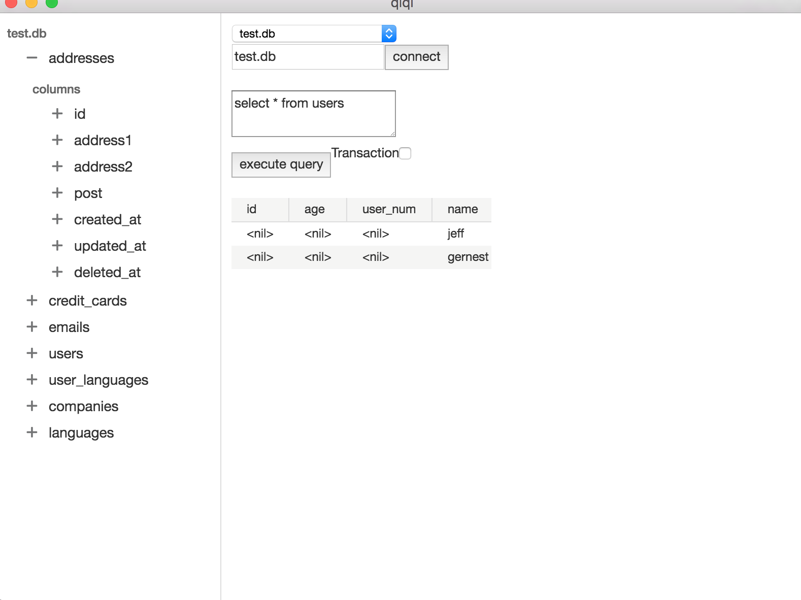

# qlql

GUI for ql database made with gopherjs, [vecty](https://github.com/gopherjs/vecty) and electron.

# Usage

See hacking below. There is nothing really useful here except to demonstrate how
you can use gopherjs to build electron applications.

# Hacking

 You need

 - go
 - gopherjs
 - npm
 - a brave heart

 Then

 - clone the repo
 - run `npm install`
 - run `git submodule update`
 - run `go get ./...`
 - run `make build-go` to build the ap1 server
 - run `make ` to build the app
 - run `npm start` to start the electron app

 So, somehow the `make build-go` won't work. Because I have made changes to
 vecty that are only available to my fork. Replace vecty packages with my fork
 of vecty before you proceed.

 Umh! did I forgot to say you might need a brave heart! :)
